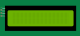
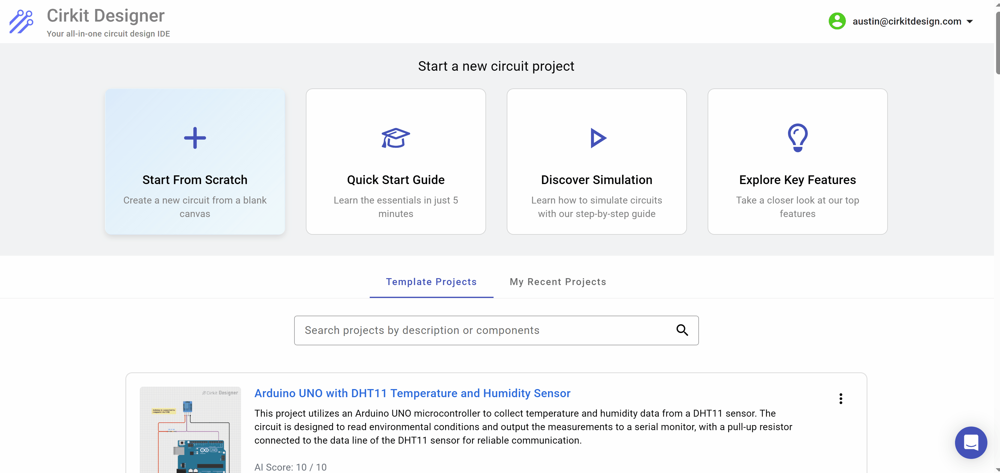
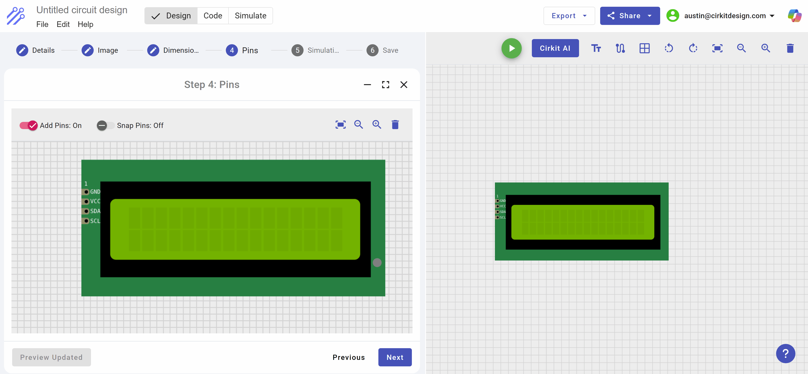

# Simulating 16x2 LCD w/I2C

## Introduction

In this tutorial, I will guide you through building the static image of a 16x2 LCD and then using Cirkit's Component AI, we will add support for simulation using the I2C communication protocol.

- Creating the custom component
- Uploading a component image (preferably .svg)
- Sizing the component
- Adding Pins and Labels
- Supporting Simulation

This is the component we are about to build:



## Creating the Component

In the Cirkit Designer App, select **Start From Scratch** and then navigate to the **Custom Components** and select "Create New Component"




### Creating a new component

Following the steps of the component creator, we will first give a name to the component **16X2 LCD Tutorial Component** and then on the next tab, we load an .svg image of a LCD which can be readily found on the internet as a raw .svg or a Fritzing part which can be loaded directly.  After loading the part, press the Preview button so that the part is displayed on the editor canvas to the right.  Clicking next, the part can be resized and once that is done, press the **Update Preview** again to refresh the image on the canvas.


Once the component image is loaded and resized, we can add pins and pin labels. The image within the editor on the left can be resized by pressing Ctrl and then increase / decrease size with the mouse wheel.



Once the Pins and Labels are correctly added, you will see an option to add simulation.  This is only available to **Standard Membership** users. 


After you click the **Enable Simulation** button, the simulation editor appears.  There are six tabs within this editor, but the four main tabs for simulation are the following:

1) UI (html)
>The UI html is the graphics that are shown for the component during simulation.  Script within the UI Script file will manipulate variables within the HTML which will illustrate the component in action as electrical signals and communication are received through the component pins.

In this example, there is a 16x2 grid of cells that characters will be displayed. Each cell is a 5x8 matrix of pixels.

2) UI Script
> The UI Script listens for changes in runtime state and reflects those changes in the UI Html. 

3) Runtime State (Json)
> The runtime state is a set of json data structures with an "id" field which is the key to each state record.  The UI script monitors the state changes and reflects those changes in the UI.
>
> Because we are dealing with a display, the component is using a Frame Buffer which is implemented as a "display" with an id of "lcdDisplay".
>
> You can see in the UI Script that it is listening to the lcdDisplay and that is what causes updates to the characters displayed on the UI as a grid of pixels.

4) Simulation Logic
> The simulation logic is the typescript code that defines the pins of the component for the purposes of electrical connectivity and messaging. Each pin can be monitored for digital and analog changes.  In this example, we will be using the I2C protocol which is a two wire protocol implemented with connectors SDA (Serial Data) and SCL (Serial Clock).


### Adding Simulation HTML, Script and State 
In order to add simulation support to a component, you must first define the runtime state variables that will be modified by the simulation logic and monitored by the UI script.  When a runtime state variable is updated by the simulation logic, the UI script subscribing to changes in state variables will modify attributes in the HTML to reflect the changes in state.  In the context of an LCD, a frame buffer will be used.

Rather than write all of the code and data structures for each tab of the LCD emulation logic, we will leverage the built-in Component AI which is able to take an image and based on the request, create the runtime data structures needed by the UI, then write the simulation logic to identify and listen to the pin changes, and apply these changes to the runtime state.  Finally, the Component AI will write the UI script and changes to the UI html needed to reflect a change in the text displayed on the LCD.

#### Open the Component AI and request it to add the features needed for simulating the LCD

By pressing the Component AI button, the component AI dialog box appears to the right of the screen.  At the bottom is the request window where you type what is to be done by the Component AI.  The purple boxes are my requests and comments to the AI.


### Below is the dialog between Component AI and myself

```
Hello! I am the component builder assistant.
If you provide me with a description of the component, any protocols that should be used and how the UI should react, I can generate code for handling wire signals and API messages as well as manipulate the state and display of the UI to reflect changes in the component

>Add support for simulating this 16x2 LCD with I2C protocol.  Insure that all upper and lower case letters are supported.  
I've loaded two highly relevant reference components:

The "16x2 I2C LCD" (shows how to simulate a 16x2 LCD with I2C, including framebuffer and ASCII character rendering)
The "OLED 128x62 I2C Display" (demonstrates I2C protocol handling and framebuffer display for a pixel-based screen)
Key takeaways for your 16x2 I2C LCD:

The 16x2 LCD reference uses a framebuffer of 80x16 (5x8 pixels per character, 16 columns × 2 rows).
It implements I2C slave logic, decodes the PCF8574 I2C backpack protocol, and renders ASCII characters (including both upper and lower case) to the framebuffer.
The UI overlays a grid of character cells, each mapped to a 5x8 pixel region in the framebuffer.
The OLED reference shows a more generic I2C display protocol and framebuffer handling, but the LCD reference is a closer match for your needs.
Next steps:
I will adapt the reference code to your component, ensuring:

I2C protocol support (PCF8574 backpack style)
Full ASCII support for upper and lower case letters
Framebuffer and UI grid matching your SVG/HTML layout
Would you like the display to support any custom characters (CGRAM), or just the standard ASCII set? If not specified, I will proceed with standard ASCII (upper/lowercase, numbers, and common symbols) as in the reference. Please confirm or add any requirements, or I will proceed to implement the simulation code for your 16x2 I2C LCD.

Standard Ascii
We now have two strong reference examples in context:

16x2 I2C LCD: Implements a 16x2 character LCD with I2C backpack, including a framebuffer, ASCII font rendering (upper/lowercase), and I2C protocol handling.
OLED 128x62 I2C Display: Demonstrates I2C protocol and framebuffer for a pixel-based display.
Plan for your 16x2 I2C LCD simulation:

State: Add a framebuffer state variable (80x16, for 16x2 chars at 5x8 pixels each).
UI: Overlay a grid matching your SVG, using Angular to render each character cell from the framebuffer.
Core Logic:
Register SCL/SDA pins.
Implement I2C slave logic for the PCF8574 backpack (as in the reference).
Decode I2C data into LCD commands/data, update DDRAM, and render to the framebuffer.
Use a standard ASCII font for all upper/lowercase letters and common symbols.
UI TS: Provide helpers to map framebuffer pixels to SVG/HTML for display.
Assumptions:

Only standard ASCII (32–127) is required (no custom CGRAM).
I2C address is fixed (e.g., 0x27) unless you specify otherwise.
The display area in your SVG is 56.2×11.5 units, so we’ll map 80×16 pixels into that region.
Next step:
I will now generate and save the simulation code for your 16x2 I2C LCD, adapting the reference logic and UI to your SVG and requirements.

The changes made to the HTML only affect the simulation (on-state) overlay and do not alter the appearance of the component while the simulator is off. The static SVG image remains correct and does not need to be updated. No action is required for the off-state image.
```

### Testing the component

Now that Component AI has updated the code and UI HTML, it is time to test.  First we need to go back to the design canvas and add an an Arduino Uno that supports simulation.  While I'm searching for the Arduino Uno in my custom components, you will find it in **Parts** section of components.  Remember to turn on the simulation components only filter.

I then wire up the Arduino Uno to the new LCD, and add the appropriate sketch code.  Notice that I leverage Cirkit AI to write the sketch code to display "Hello World" on the LCD.

One thing that AI does not catch when writing the code is the need to specify the size of the LCD in columns and rows.  That **Gotcha** can cost you a few frustrating moments of decoding.

 


After testing the component, you can see that it is almost there, so I asked Component AI to fix the problem.  Here is the dialog:


```
The simulation of the LCD is almost complete.  The only issue is the characters are slightly larger than the pixel grid they are required to fit.  They are effectively 1 pixel too big, so I would scale the characters down by that much.
Thank you for the clear description! Before making any code changes, I’ll review the relevant reference examples to see how they handle pixel scaling and grid alignment for character displays. This will help ensure the solution is robust and consistent with best practices.

The most relevant reference components for LCD/character display pixel scaling are:

16x2 I2C LCD (already in your current code, but I’ll fetch the official reference for comparison)
OLED 128x62 I2C Display (demonstrates framebuffer pixel scaling and grid alignment)
4 Digit Seven Segment Display (shows segment/pixel alignment in a grid)
I will fetch the simulation code for these components now.

I've reviewed the official reference code for the 16x2 I2C LCD, OLED 128x62 I2C Display, and 4 Digit Seven Segment Display. Here are the key findings relevant to your scaling issue:

Reference Insights:

The 16x2 I2C LCD reference uses a 5x8 pixel grid per character, and in its UI, each character's pixels are rendered in a grid, matching the framebuffer.
The reference's renderChar function always draws within a 5x8 area, and the UI overlays a grid of 16x2 characters, each with 5x8 pixels.
Your current code uses SVG rectangles for each pixel, but the scaling factors (xScale, yScale) are slightly too large, causing the character pixels to overflow the intended grid.
Solution Plan:

To fix the overflow, reduce the scaling factors so that the 16 characters × 5 pixels (80) and 2 rows × 8 pixels (16) fit exactly within the display area.
The correct scale is:
xScale = (display width) / (16 * 5) = 56.2 / 80 = 0.7025 (already used, but may need a slight reduction)
yScale = (display height) / (2 * 8) = 11.5 / 16 = 0.71875 (already used, but may need a slight reduction)
However, since the characters are "1 pixel too big," we should subtract 1 from the pixel count in each direction for scaling:
xScale = 56.2 / (16 * 5 + 1) = 56.2 / 81 ≈ 0.6938
yScale = 11.5 / (2 * 8 + 1) = 11.5 / 17 ≈ 0.6765
Action:

Update the xScale and yScale in your UI TypeScript to these new values.
This will ensure the character grid fits perfectly within the intended area.
I will now update the ui-component-ts.ts file accordingly.

The character pixel scaling has been adjusted in the simulation UI code. The xScale and yScale values are now slightly reduced so that the 16x2 character grid (each character 5x8 pixels) fits perfectly within the display area, eliminating the overflow by one pixel. This should resolve the issue of characters being too large for the pixel grid. If you need further fine-tuning or visual tweaks, let me know!

Still too big, the H is in the gap between it and the e in Hello.
Thank you for the update! Since the character pixels are still too large and are overlapping into the gap between characters, it’s clear that the scaling needs further adjustment. To ensure the best approach, let’s review how the official 16x2 I2C LCD and OLED 128x62 I2C Display references handle pixel and character spacing in their UI rendering.

Plan:

Fetch the simulation code for both the 16x2 I2C LCD and OLED 128x62 I2C Display reference components.
Examine how they calculate pixel size, character spacing, and grid layout.
Use their approach to refine your scaling and spacing so that each character fits perfectly in its cell, with a visible gap between characters.
Proceeding to fetch both references now.

Here’s what the official 16x2 I2C LCD reference does for character and pixel layout:

UI Layer:

Uses a CSS grid for 16 columns × 2 rows, with a gap property (3px) between character cells.
Each character cell contains a 5×8 grid of “pixels” (divs), with a small gap (0.5px) between pixels.
The grid overlay’s width and height are set to match the LCD’s visible area, and the gap between characters is handled by the CSS grid, not by scaling the pixels to fill the entire width.
Framebuffer Mapping:

The framebuffer is 80×16 pixels (16×5, 2×8).
Each character’s pixels are mapped directly from the framebuffer, but the UI grid ensures a gap between characters.
Key insight:
The reference does not scale the pixels to fill the entire width/height. Instead, it leaves a gap between character cells, so the pixels for each character fit comfortably within their cell, and the gap is visually preserved.

How to fix your simulation:

Do not scale the pixels to fill the entire 56.2×11.5 area.
Instead, calculate the pixel size so that 5 pixels + a gap (or margin) per character fit within the total width, and 8 pixels + a gap per row fit within the total height.
Add a gap between character cells (e.g., 1 pixel or a fraction of your SVG units).
Adjust your x/y calculation for each pixel to include this gap.
Next step:
I will update your UI code to:

Add a small gap between character cells (e.g., 0.5 SVG units).
Adjust the scaling so that each character’s 5×8 pixels fit within their cell, and the total grid (including gaps) fits the display area.
This will ensure that characters like “H” and “e” do not overlap and the display looks correct.

The recent HTML changes only affect the dynamic SVG overlay for the LCD pixels and do not alter the static off-state appearance of the component. Therefore, the static SVG image does not need to be updated. The off-state look remains correct and consistent with the component's physical appearance.

```

### Second Attempt to complete the component

As we can see in the image capture, the result was not stellar.  I should not have told Component AI to scale the fonts. In order to correct this mistake, I had to revert the changes and ask Component AI to try again.


### Third Attempt to complete the component

After reverting the most recent change and clearing the chat history, the result was much better as the characters now fit inside the character grid. I could continue to refine the UI, but the basic function of the grid is now completed and the component can be saved.  **Don't forget to save the component!**


### Final Tweaks

I wanted to LCD pixels to be a little more obvious and I also wanted to component to support the digits 0-9.  For some reason, the AI was being lazy and did not include the digits.


## Completed Component Code

### Simulation Logic


```ts
import { AbstractSimulationComponentLogic, IFrameBuffer, IPin, u8 } from '@cirkit/simulation/logic';

export class SimulationComponentLogic extends AbstractSimulationComponentLogic {
  private sclPin: IPin;
  private sdaPin: IPin;
  private i2cAddress: number = 0x27; // Default backpack address

  private ddram = new Uint8Array(128); // LCD DDRAM (80 chars, but only 32 visible)
  private cursorPos = 0;
  private nibbleBuffer: number[] = [];
  private backlight = true;
  private rs = 0;
  private rw = 0;
  private en = 0;
  private d4 = 0;
  private d5 = 0;
  private d6 = 0;
  private d7 = 0;
  private isConnected = false;
  private isWriteMode = true;
  private displayOn = true;
  private entryIncrement = true;

  public init(): void {
    this.ddram.fill(0x20); // Fill with spaces
    this.sclPin = this.simulation.api.pin.createInputPin('SCL');
    this.sdaPin = this.simulation.api.pin.createInputPin('SDA');
    this.simulation.api.i2c.createI2CSlave(
      this.i2cAddress,
      this.sclPin,
      this.sdaPin,
      {
        connect: this.onConnect.bind(this),
        writeByte: this.writeByte.bind(this),
        readByte: this.readByte.bind(this),
        disconnect: this.onDisconnect.bind(this),
      }
    );
    this.simulation.hideStaticPicture();
    this.updateDisplay();
  }

  private onConnect(address: u8, isWriteMode: boolean): boolean {
    if (address === this.i2cAddress) {
      this.isConnected = true;
      this.isWriteMode = isWriteMode;
      return true;
    }
    this.isConnected = false;
    return false;
  }

  private onDisconnect() {
    this.isConnected = false;
  }

  private writeByte(data: u8): boolean {
    if (!this.isConnected || !this.isWriteMode) return false;
    // PCF8574: P0=RS, P1=RW, P2=EN, P3=Backlight, P4-7=D4-7
    const p0 = (data >> 0) & 1; // RS
    const p1 = (data >> 1) & 1; // RW
    const p2 = (data >> 2) & 1; // EN
    const p3 = (data >> 3) & 1; // Backlight
    const p4 = (data >> 4) & 1; // D4
    const p5 = (data >> 5) & 1; // D5
    const p6 = (data >> 6) & 1; // D6
    const p7 = (data >> 7) & 1; // D7
    this.backlight = !!p3;
    // Rising edge on EN latches nibble
    if (this.en === 0 && p2 === 1) {
      const nibble = (p7 << 3) | (p6 << 2) | (p5 << 1) | (p4 << 0);
      this.latchNibble(nibble, p0);
    }
    this.rs = p0;
    this.rw = p1;
    this.en = p2;
    this.d4 = p4;
    this.d5 = p5;
    this.d6 = p6;
    this.d7 = p7;
    return true;
  }

  private readByte(): u8 {
    return 0xff; // Not used
  }

  private latchNibble(nibble: number, rs: number): void {
    this.nibbleBuffer.push(nibble);
    if (this.nibbleBuffer.length === 2) {
      const byte = (this.nibbleBuffer[0] << 4) | this.nibbleBuffer[1];
      this.nibbleBuffer = [];
      if (rs === 0) {
        this.processCommand(byte);
      } else {
        this.writeData(byte);
      }
    }
  }

  private processCommand(cmd: number): void {
    if ((cmd & 0x80) === 0x80) {
      // Set DDRAM address
      this.cursorPos = cmd & 0x7f;
    } else if ((cmd & 0x01) === 0x01) {
      // Clear display
      this.ddram.fill(0x20);
      this.cursorPos = 0;
      this.updateDisplay();
    } else if ((cmd & 0x02) === 0x02) {
      // Return home
      this.cursorPos = 0;
    } else if ((cmd & 0xf8) === 0x08) {
      // Display ON/OFF
      this.displayOn = (cmd & 0x04) !== 0;
      this.updateDisplay();
    } else if ((cmd & 0xf8) === 0x04) {
      // Entry mode set
      this.entryIncrement = (cmd & 0x02) !== 0;
    }
    // (Other commands: not implemented for brevity)
  }

  private writeData(data: number): void {
    this.ddram[this.cursorPos & 0x7f] = data;
    if (this.entryIncrement) {
      this.cursorPos = (this.cursorPos + 1) & 0x7f;
    } else {
      this.cursorPos = (this.cursorPos - 1) & 0x7f;
    }
    this.updateDisplay();
  }

  private updateDisplay(): void {
    const fb = this.simulation.runtimeState.getFrameBuffer('lcdDisplay');
    if (!this.displayOn) {
      fb.clear();
      return;
    }
    // 16x2 chars, each 5x8 pixels
    for (let row = 0; row < 2; row++) {
      for (let col = 0; col < 16; col++) {
        const addr = row === 0 ? col : 0x40 + col;
        const charCode = this.ddram[addr];
        this.renderChar(fb, col, row, charCode);
      }
    }
  }

  private renderChar(fb: IFrameBuffer, col: number, row: number, charCode: number): void {
    const font = this.getFont(charCode);
    const x0 = col * 5;
    const y0 = row * 8;
    for (let y = 0; y < 8; y++) {
      for (let x = 0; x < 5; x++) {
        const on = (font[y] >> (4 - x)) & 1;
        fb.setPixel(x0 + x, y0 + y, on ? 34 : 0, on ? 34 : 0, on ? 34 : 0, on ? 255 : 0);
      }
    }
  }

  // Returns a Uint8Array[8] for 5x8 font, standard ASCII 32-127
  private getFont(charCode: number): Uint8Array {
    // Only a subset shown for brevity; fill out as needed
    const font: { [key: number]: Uint8Array } = {
      0x20: new Uint8Array([0,0,0,0,0,0,0,0]), // space
      0x41: new Uint8Array([0x0e,0x11,0x11,0x1f,0x11,0x11,0x11,0]), // A
      0x42: new Uint8Array([0x1e,0x11,0x11,0x1e,0x11,0x11,0x1e,0]), // B
      0x43: new Uint8Array([0x0e,0x11,0x10,0x10,0x10,0x11,0x0e,0]), // C
      0x44: new Uint8Array([0x1e,0x11,0x11,0x11,0x11,0x11,0x1e,0]), // D
      0x45: new Uint8Array([0x1f,0x10,0x10,0x1e,0x10,0x10,0x1f,0]), // E
      0x46: new Uint8Array([0x1f,0x10,0x10,0x1e,0x10,0x10,0x10,0]), // F
      0x47: new Uint8Array([0x0e,0x11,0x10,0x13,0x11,0x11,0x0e,0]), // G
      0x48: new Uint8Array([0x11,0x11,0x11,0x1f,0x11,0x11,0x11,0]), // H
      0x49: new Uint8Array([0x0e,0x04,0x04,0x04,0x04,0x04,0x0e,0]), // I
      0x4a: new Uint8Array([0x1f,0x01,0x01,0x01,0x01,0x11,0x0e,0]), // J
      0x4b: new Uint8Array([0x11,0x12,0x14,0x18,0x14,0x12,0x11,0]), // K
      0x4c: new Uint8Array([0x10,0x10,0x10,0x10,0x10,0x10,0x1f,0]), // L
      0x4d: new Uint8Array([0x11,0x1b,0x15,0x15,0x11,0x11,0x11,0]), // M
      0x4e: new Uint8Array([0x11,0x19,0x15,0x13,0x11,0x11,0x11,0]), // N
      0x4f: new Uint8Array([0x0e,0x11,0x11,0x11,0x11,0x11,0x0e,0]), // O
      0x50: new Uint8Array([0x1e,0x11,0x11,0x1e,0x10,0x10,0x10,0]), // P
      0x51: new Uint8Array([0x0e,0x11,0x11,0x11,0x15,0x12,0x0d,0]), // Q
      0x52: new Uint8Array([0x1e,0x11,0x11,0x1e,0x14,0x12,0x11,0]), // R
      0x53: new Uint8Array([0x0f,0x10,0x10,0x0e,0x01,0x01,0x1e,0]), // S
      0x54: new Uint8Array([0x1f,0x04,0x04,0x04,0x04,0x04,0x04,0]), // T
      0x55: new Uint8Array([0x11,0x11,0x11,0x11,0x11,0x11,0x0e,0]), // U
      0x56: new Uint8Array([0x11,0x11,0x11,0x11,0x0a,0x0a,0x04,0]), // V
      0x57: new Uint8Array([0x11,0x11,0x15,0x15,0x15,0x1b,0x11,0]), // W
      0x58: new Uint8Array([0x11,0x11,0x0a,0x04,0x0a,0x11,0x11,0]), // X
      0x59: new Uint8Array([0x11,0x11,0x0a,0x04,0x04,0x04,0x04,0]), // Y
      0x5a: new Uint8Array([0x1f,0x01,0x02,0x04,0x08,0x10,0x1f,0]), // Z
      0x61: new Uint8Array([0x00,0x0e,0x01,0x0f,0x11,0x11,0x0f,0]), // a
      0x62: new Uint8Array([0x10,0x10,0x1e,0x11,0x11,0x11,0x1e,0]), // b
      0x63: new Uint8Array([0x00,0x0f,0x10,0x10,0x10,0x10,0x0f,0]), // c
      0x64: new Uint8Array([0x01,0x01,0x0f,0x11,0x11,0x11,0x0f,0]), // d
      0x65: new Uint8Array([0x00,0x0e,0x11,0x1f,0x10,0x10,0x0f,0]), // e
      0x66: new Uint8Array([0x07,0x08,0x08,0x1e,0x08,0x08,0x08,0]), // f
      0x67: new Uint8Array([0x0f,0x11,0x11,0x11,0x0f,0x01,0x1e,0]), // g
      0x68: new Uint8Array([0x10,0x10,0x1e,0x11,0x11,0x11,0x11,0]), // h
      0x69: new Uint8Array([0x04,0x00,0x0c,0x04,0x04,0x04,0x0e,0]), // i
      0x6a: new Uint8Array([0x02,0x00,0x06,0x02,0x02,0x12,0x0c,0]), // j
      0x6b: new Uint8Array([0x10,0x10,0x12,0x14,0x18,0x14,0x12,0]), // k
      0x6c: new Uint8Array([0x0c,0x04,0x04,0x04,0x04,0x04,0x0e,0]), // l
      0x6d: new Uint8Array([0x00,0x1b,0x15,0x15,0x15,0x15,0x15,0]), // m
      0x6e: new Uint8Array([0x00,0x1e,0x11,0x11,0x11,0x11,0x11,0]), // n
      0x6f: new Uint8Array([0x00,0x0e,0x11,0x11,0x11,0x11,0x0e,0]), // o
      0x70: new Uint8Array([0x00,0x1e,0x11,0x11,0x1e,0x10,0x10,0]), // p
      0x71: new Uint8Array([0x00,0x0f,0x11,0x11,0x0f,0x01,0x01,0]), // q
      0x72: new Uint8Array([0x00,0x0f,0x10,0x10,0x10,0x10,0x10,0]), // r
      0x73: new Uint8Array([0x00,0x0f,0x10,0x0e,0x01,0x11,0x0e,0]), // s
      0x74: new Uint8Array([0x08,0x1e,0x08,0x08,0x08,0x08,0x06,0]), // t
      0x75: new Uint8Array([0x00,0x11,0x11,0x11,0x11,0x11,0x0e,0]), // u
      0x76: new Uint8Array([0x00,0x11,0x11,0x11,0x0a,0x0a,0x04,0]), // v
      0x77: new Uint8Array([0x00,0x11,0x11,0x15,0x15,0x15,0x0a,0]), // w
      0x78: new Uint8Array([0x00,0x11,0x0a,0x04,0x04,0x0a,0x11,0]), // x
      0x79: new Uint8Array([0x00,0x11,0x11,0x11,0x0f,0x01,0x1e,0]), // y
      0x7a: new Uint8Array([0x00,0x1f,0x01,0x02,0x04,0x08,0x1f,0]), // z
    };
    return font[charCode] || new Uint8Array(8).fill(0);
  }
}

```

### Runtime State

```json
{
  "runtimeStateVariables": [
    {
      "id": "lcdDisplay",
      "type": "display",
      "width": 80,
      "height": 16
    }
  ]
}
```

### UI Script (Typescript)

```ts
import { AbstractSimulationComponentUI, IFrameBuffer } from '@cirkit/simulation/ui';

export class SimulationComponentUI extends AbstractSimulationComponentUI {
  public rows = Array(2);
  public cols = Array(16);
  public pixelRows = Array(8);
  public pixelCols = Array(5);

  // Add a gap between character cells (SVG units)
  public charGapX = 0.7; // horizontal gap between characters
  public charGapY = 0.5; // vertical gap between rows

  // Calculate the width/height of a character cell (including gap)
  public charCellWidth = (56.2 - (15 * this.charGapX)) / 16; // 16 chars, 15 gaps
  public charCellHeight = (11.5 - (1 * this.charGapY)) / 2;  // 2 rows, 1 gap

  // Each pixel's size within a character cell
  public xScale = this.charCellWidth / 5;
  public yScale = this.charCellHeight / 8;

  private framebuffer: IFrameBuffer | null = null;

  public init(): void {
    this.framebuffer = this.simulation.runtimeState.getFrameBuffer('lcdDisplay');
  }

  public isPixelOn(col: number, row: number, px: number, py: number): boolean {
    if (!this.framebuffer) return false;
    const x = col * 5 + px;
    const y = row * 8 + py;
    const pixel = this.framebuffer.getPixel(x, y);
    return pixel.a > 0;
  }

  // Calculate the X position for a pixel, including character gap
  public getPixelX(colIdx: number, pxIdx: number): number {
    return 12.45 + colIdx * (this.charCellWidth + this.charGapX) + pxIdx * this.xScale;
  }

  // Calculate the Y position for a pixel, including row gap
  public getPixelY(rowIdx: number, pyIdx: number): number {
    return 12.55 + rowIdx * (this.charCellHeight + this.charGapY) + pyIdx * this.yScale;
  }
}

```

### UI Html

```html
<!--
16x2 I2C LCD UI Layer
──────────────────────────────────────────────
This overlays the LCD character grid on the SVG display area.
-->
<svg xmlns="http://www.w3.org/2000/svg" width="100%" height="100%" viewBox="0 0 80 36" style="font-size:1.5px;font-family:monospace" version="1.1">
  <defs>
    <pattern id="characters" width="3.55" height="5.95" patternUnits="userSpaceOnUse" x="12.45" y="12.55">
      <rect width="2.95" height="5.55" fill-opacity="0.05"/>
    </pattern>
    <pattern id="pins" width="2.54" height="3.255" patternUnits="userSpaceOnUse" y="1.1">
      <path fill="#92926d" d="M0,0.55c0,0 0.21,-0.52 0.87,-0.52                0.67,0 0.81,0.51 0.81,0.51v1.81h-1.869z"/>
      <circle r="0.45" cx="0.827" cy="0.9"/>
    </pattern>
  </defs>
  <rect width="80" height="36" fill="#087f45"/>
  <rect x="4.95" y="5.7" width="71.2" height="25.2"/>
  <rect x="7.55" y="10.3" width="66" height="16" rx="1.5" ry="1.5" fill="#6cb201"/>
  <rect x="7.55" y="10.3" width="66" height="16" rx="1.5" ry="1.5" opacity="0"/>
  <rect x="7.55" y="-2.5" width="10.16" height="2.5" fill="url(#pins)" transform="rotate(90)"/>
  <text fill="white" font-family="monospace" font-size="1.5px">
    <tspan x="2.3" y="8.9">GND</tspan>
    <tspan x="2.3" y="11.4">VCC</tspan>
    <tspan x="2.3" y="14">SDA</tspan>
    <tspan x="2.3" y="16.6">SCL</tspan>
  </text>
  <rect x="12.45" y="12.55" width="56.2" height="11.5" fill="url(#characters)"/>
  <!-- LCD character grid overlay -->
  <g *ngFor="let row of component.rows; let rowIdx = index">
    <g *ngFor="let col of component.cols; let colIdx = index">
      <g *ngFor="let py of component.pixelRows; let pyIdx = index">
        <g *ngFor="let px of component.pixelCols; let pxIdx = index">
          <rect [attr.x]="component.getPixelX(colIdx, pxIdx)"
                [attr.y]="component.getPixelY(rowIdx, pyIdx)"
                [attr.width]="component.xScale"
                [attr.height]="component.yScale"
                [attr.fill]="component.isPixelOn(colIdx, rowIdx, pxIdx, pyIdx) ? '#222' : '#b6e685'"
                [attr.opacity]="component.isPixelOn(colIdx, rowIdx, pxIdx, pyIdx) ? 1 : 0.18"/>
        </g>
      </g>
    </g>
  </g>
</svg>

```

