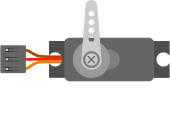
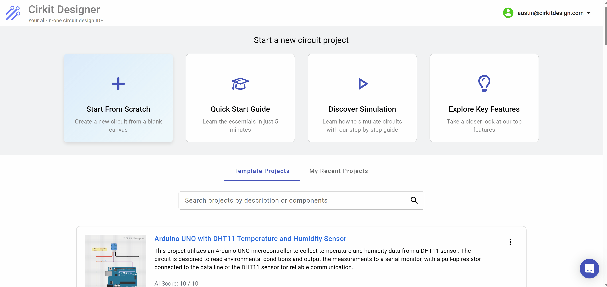
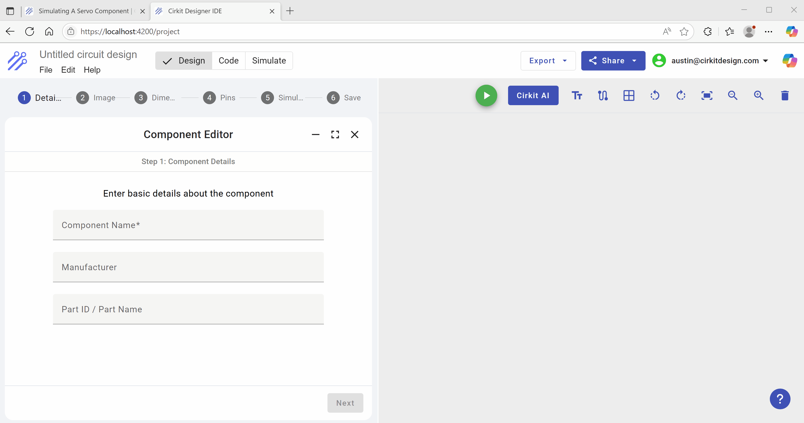
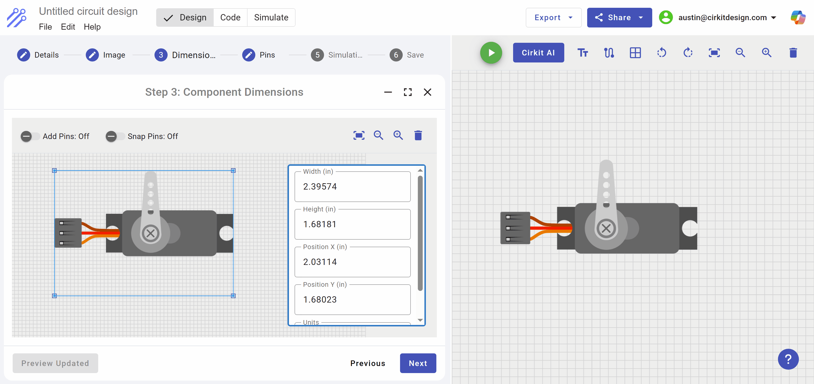
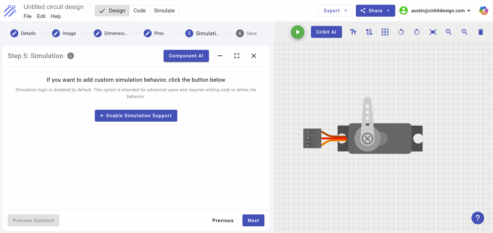
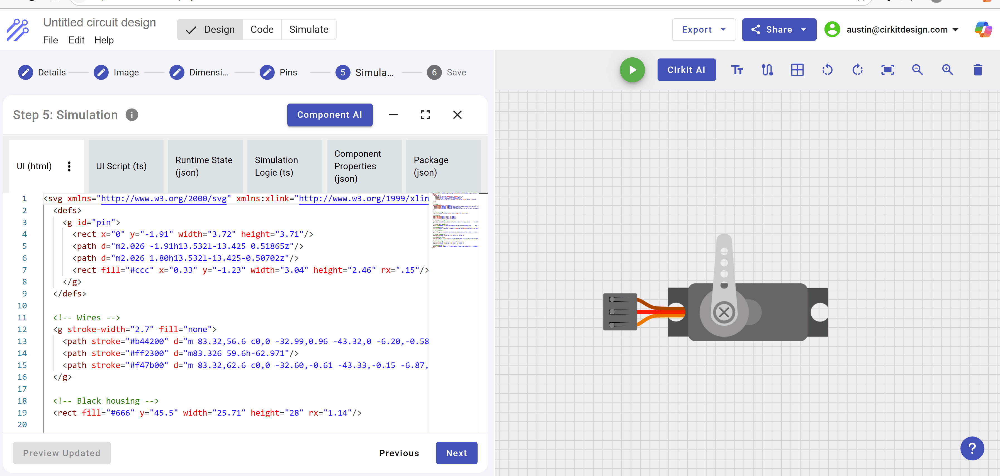

# Simulating A Servo Component

## Introduction

In this tutorial, I will guide you through building the static image of a Servo and then using Cirkit's Component AI, we will add support for simulation.

- Creating the custom component
- Uploading a component image (preferably .svg)
- Sizing the component
- Adding Pins and Labels
- Supporting Simulation

This is the component we are about to build:



## Creating the Component

In the Cirkit Designer App, select **Start From Scratch** and then navigate to the **Custom Components** and select "Create New Component"




### Creating a new component

Following the steps of the component creator, we will first give a name to the component **Servo Tutorial Component** and then on the next tab, we load an .svg image of a servo which can be readily found on the internet as a raw .svg or a Fritzing part which can be loaded directly.  After loading the part, press the Preview button so that the part is displayed on the editor canvas to the right.  Clicking next, the part can be resized and once that is done, press the **Update Preview** again to refresh the image on the canvas.



Once the component is loaded and resized, we can add pins and pin labels. The image within the editor on the left can be resized by pressing Ctrl and then increase / decrease size with the mouse wheel.



Once the Pins and Labels are correctly added, you will see an option to add simulation.  This is only available to **Standard Membership** users. 



After you click the **Enable Simulation** button, the simulation editor appears.  There are six tabs within this editor, but the four main tabs for simulation are the following:

1) UI (html)
>The UI html is the graphics that are shown for the component during simulation.  Script within the UI Script file will manipulate variables within the HTML which will illustrate the component in action as electrical signals and communication are received through the component pins.

2) UI Script
> The UI Script listens for changes in runtime state and reflects those changes in the UI Html.

3) Runtime State (Json)
> The runtime state is a set of json data structures with an "id" field which is the key to each state record.  The UI script monitors the state changes and reflects those changes in the UI.

4) Simulation Logic
> The simulation logic is the typescript code that defines the pins of the component for the purposes of electrical connectivity and messaging. Each pin can be monitored for digital and analog changes.


### Adding Simulation HTML, Script and State 
In order to add simulation support to a component, you must first define the runtime state variables that will be modified by the simulation logic and monitored by the UI script.  When a runtime state variable is updated by the simulation logic, the UI script subscribing to changes in state variables will modify attributes in the HTML to reflect the changes in state.  In the context of the Servo, the only runtime variable that is monitored is the angle of the horn (arm) of the servo.  As the angle is modified, the horn in the UI transitions from the current angle to the new angle.

Rather than write all of the code and data structures for each tab of the servo emulation logic, we will leverage the built-in Component AI which is able to take an image and based on the request, create the runtime data structures needed by the UI, then write the simulation logic to identify and listen to the pin changes, and apply these changes to the runtime state.  Finally, the Component AI will write the UI script and changes to the UI html needed to reflect a change in the servo's angle of the horn.

#### Open the Component AI and request it to add the features needed for simulating the Servo

By pressing the Component AI button, the component AI dialog box appears to the right of the screen.  At the bottom is the request window where you type what is to be done by the Component AI.



Once the Component AI is engaged, it may ask questions as it builds out the logic.  In this example, the Component AI asked if there were changes in the horn (arm of the servo), otherwise it would proceed with the default assumptions. We respond with "Proceed", thus the component AI will build with the default assumptions.


Looking into the simulation logic code generated, we can see that the three pins on the component are defined for the simulator.  This allows the simulator to reference the circuit design, identify the wires connected to these pins and reflect electrical signals on the pins to the simulation logic.

In the case of the Servo, the only pin to watch is the Pulse Width Modulation which is monitored on both the rise and fall of voltage at the pin.  If you read the code, you can better understand how Cirkit actually implements the simulation logic, reflects changes in voltage levels at the PWM pin, and then propagates those changes to the UI via the runtime state variables that are monitored by the UI script.

### Simulation Logic written by AI
```ts

import {
  AbstractSimulationComponentLogic,
  EdgeEnum,
  LogLevelEnum,
} from '@cirkit/simulation/logic';

export class SimulationComponentLogic extends AbstractSimulationComponentLogic {
  private pwmStartTime: bigint | null = null;

  init(): void {
    // Hide the static servo image that is used for circuit design and replace
    // with the simulated servo.
    this.simulation.hideStaticPicture();

    // Create the three pins: VCC, GND, and PWM
    const vccPin = this.simulation.api.pin.createInputPin('VCC');
    const gndPin = this.simulation.api.pin.createInputPin('GND');
    const pwmPin = this.simulation.api.pin.createInputPin('PWM');

    // Register a digital pin watch on the PWM pin for both edges
    this.simulation.api.pin.addDigitalPinWatch(
      pwmPin,
      EdgeEnum.Both,
      (pin, voltage) => {
        if (voltage > 0) {

          // Rising edge: record the current simulation time in nanoseconds
          this.pwmStartTime = this.coreSimulationAPI.getCurrentTimeNanos();
        } else {

          // Falling edge: if a pulse was started, calculate its width
          if (this.pwmStartTime !== null) {
            const endTime = this.coreSimulationAPI.getCurrentTimeNanos();
            const pulseWidthNanos = endTime - this.pwmStartTime;
            const pulseWidthMs = Number(pulseWidthNanos) / 1e6;

            // Map a pulse width from ~1ms to 2ms to an angle between 0° and 180°
            let computedAngle = (pulseWidthMs - 1) * 180;
            computedAngle = Math.max(0, Math.min(180, computedAngle));

            // Update the simulation state variable "angle"
            this.simulation.runtimeState.updateDecimalState('angle', computedAngle);
            this.pwmStartTime = null;
            this.simulation.log(
              `Setting Servo Angle to ${computedAngle}`,
              LogLevelEnum.DEBUG,
            );
          }
        }
      },
    );
  }
}

```

### Notice the update to the simulation state "angle"

```json
{
  "runtimeStateVariables": [
    {
      "id": "angle",
      "type": "decimal",
      "initialValue": "0",
      "isVisibleToUser": false
    }
  ]
}

```

### UI Script monitors state variables

```ts
import { AbstractSimulationComponentUI } from '@cirkit/simulation/ui';

export class SimulationComponentUI extends AbstractSimulationComponentUI {
  angle: number = 0;

  init() {
    // Subscribe to the "angle" state variable updates coming from the core.
    this.simulation.runtimeState.subscribeToDecimalStateUpdates(
      'angle',
      (newAngle: number) => {
        this.angle = newAngle;
        this.simulation.api.triggerUIRefresh();
      },
    );
  }

  // Returns the SVG path for the servo horn (single type)
  getHornPath(): string {
    return 'm101.6 59.589-4.3167-54.166c0-2.8654-2.6026-5.1912-5.8145-5.1912s-5.8145 2.3258-5.8145 5.1912l-4.3167 54.166a8.3264 8.3264 0 0 0-0.10234 1.2792c0 5.047 4.5818 9.1381 10.234 9.1381s10.234-4.0911 10.234-9.1381a8.3264 8.3264 0 0 0-0.10233-1.2792zm-10.131-48.658a2.791 2.791 0 1 1-2.791 2.791 2.791 2.791 0 0 1 2.791-2.791zm0 8.6055a2.791 2.791 0 1 1-2.791 2.791 2.791 2.791 0 0 1 2.791-2.791zm0 8.3729a2.791 2.791 0 1 1-2.791 2.791 2.791 2.791 0 0 1 2.791-2.791zm0 8.6055a2.791 2.791 0 1 1-2.791 2.791 2.791 2.791 0 0 1 2.791-2.791zm5.9215 29.412a8.3729 8.3729 0 1 1 0-11.843 8.3729 8.3729 0 0 1 0 11.843z';
  }
}
```

### UI Updates from UI script
Notice that the only actual changes to the component HTML is a transform on the horn  to reflect the angle, so very little UI code is modified to support simulation

```html
<path fill="#ccc"
    [attr.transform]="'translate(91.467 59.773) rotate(' + component.angle + ') translate(-91.467 -59.773)'"
    [attr.d]="component.getHornPath()" />
``` 

### Testing the simulation logic

In addition to the embedded Component AI, Cirkit also utilizes side by side simulation within the editor.  This means you can iteratively build a component, add it to a circuit, test the component, make further changes, or accept the component as completed.

The following demonstrates adding an Arduino Uno to the editor's canvas, wiring up the component, coding the Arduino using AI for the Servo and running the simulation.


