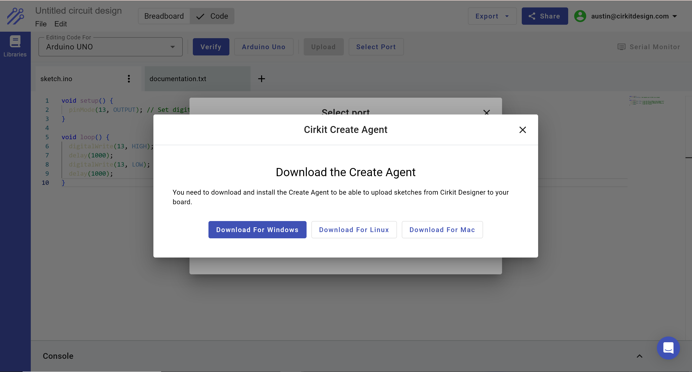

# Creating Your First Circuit With Cirkit Designer

## Introduction

In this tutorial, I will walk you through building a simple circuit to blink an LED with an Arduino UNO. This tutorial will teach you the following skills in Cirkit Designer:

- Creating a circuit wiring diagram in Cirkit Designer
- Writing code for an Arduino UNO in Cirkit Designer
- Compiling and uploading code to the Arduino UNO to test

This is the circuit we're about to build:


## Step 1: Creating the wiring diagram

To get started, we'll open the Cirkit Designer app at https://app.cirkitdesigner.com and select **Blank project** to create an empty circuit project.

### Adding electronic components

Next, we're going to add the followng parts to our circuit: an Arduino UNO, a red LED, and a resistor.

To add the Arduino, we'll search for the part in the components panel on the left, and click and drag that part onto the circuit canvas.


We can follow the same process to search for and add the resistor and red LED to the circuit, so our circuit has all of the components that we need:


### Wiring together the components

In order for this circuit to function, we need to connect the LED to the Arduino. We will use digital pin 13 on the Arduino to control the on/off state of the LED. To do so, we will place the following wires:

- D13 on the Arduino \<-\> Pin 1 on the resistor
- Pin 2 on the resistor \<-\> Anode of the LED
- Cathod of the LED \<-\> GND (ground) on the Arduino


## Step 2: Writing code to blink the LED

Next we will write Arduino code that will blink the LED. To start coding, we will open up the IDE:


And we're going to insert the following code into the IDE:

```ino
void setup() {
  pinMode(13, OUTPUT); // Set digital pin 13 (D13) as an output
}

void loop() {
  digitalWrite(13, HIGH); // Turn the LED on (HIGH is the voltage level)
  delay(1000);            // Wait for a second (1000 milliseconds)
  digitalWrite(13, LOW);  // Turn the LED off by making the voltage LOW
  delay(1000);            // Wait for a second
}
```

So your IDE should look like this:


## Step 3: Compiling and uploading code to the Arduino UNO

### Compiling the code

The next step is to compile (verify) the code, to make sure that the code is valid and can be programmed to the Arduino. We can compile our code by clicking the **Verify** button. After this step completes, your IDE should show the results of the compilation step. If the console output (at the bottom of the screen) is green, then the compilation succeeded. If it's red, then compilation failed, which typically means there is an error in the code that was written.

After compilation has completed, you should see a console window that has popped up at the bottom of the screen, and the compilation result should be highlighted green:


### Uploading the code

The final step to complete this project is to upload the code to the Arduino, so it can actually run and blink the LED. First, connect an Arduino UNO to your computer with a USB cable. 

Notice that the **Upload Code** button is currently gray and disabled. This is because we need to select the port to identify the physical Arduino UNO board we are uploading code to. Click **Select Port**.

If this is your first time uploading code with Cirkit Designer, then you will see the following screen indicating that the Cirkit Create Agent has not been found.


The Cirkit Create Agent is a program that runs locally on your computer and acts as an intermediary between the Cirkit web app and your physical Arduino board. When you upload code to an Arduino, that code is passed from the Cirkit web app to the Cirkit Create Agent, which then transfers that code to your Arduino board.

We will click **Download** to proceed and install the Cirkit Create Agent. After selecting Download, you should see the following screen:


We'll select **Start** to continue, which will take us to a screen with options to download the Cirkit Create Agent. I'm on a Windows computer, so I'll select **Download for Windows**.



After selecting Download for Windows, you should see that the Cirkit Create Agent installer was downloaded. **Double-click the installer to start the installation process.** You should see the following pop-up:


Click **Next** and proceed through the installation steps. After installation has completed, return to the Cirkit web app. You should see the following screen, indicating that the installation has completed:


Select **Next** to proceed to the next screen. You should see an option to select the Arduino UNO that is connected to your computer via USB:


Select the Arduino UNO, and you should see that the **Upload** button is now active (blue):


Select **Upload** to transfer the code to your Arduino. After the upload has completed, your should see a green output in the console, indicating that the upload has succeeded:


If you've wired up an LED and resistor to your Arduino, you should now see the LED blinking on and off!
