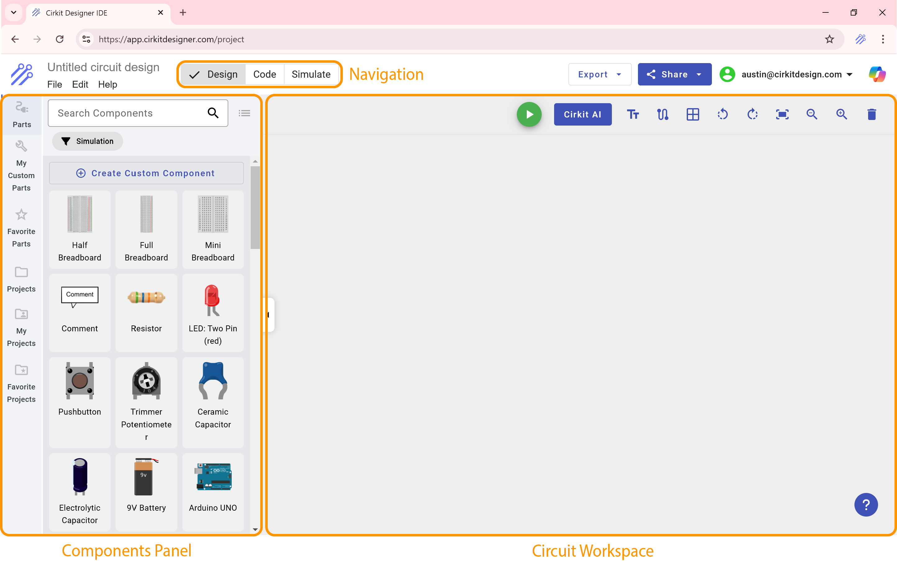
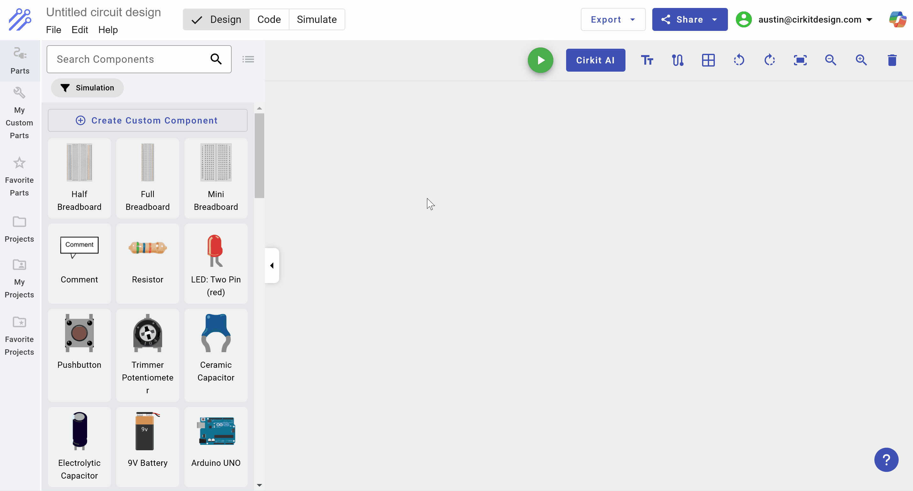
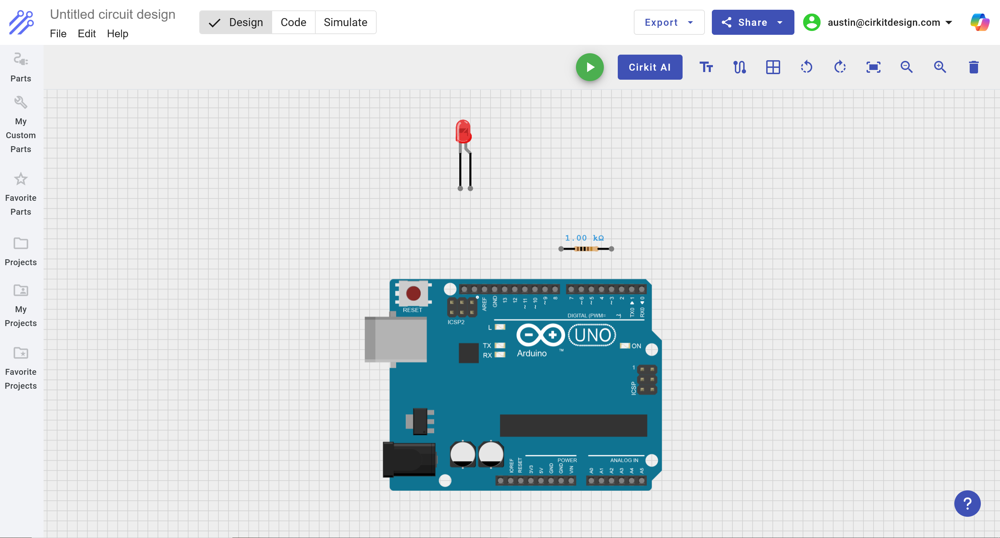
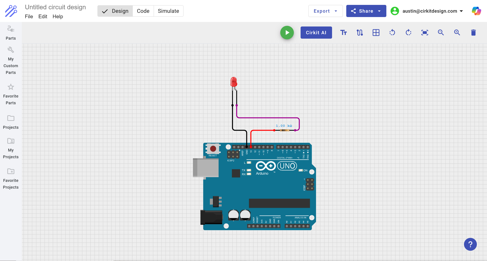
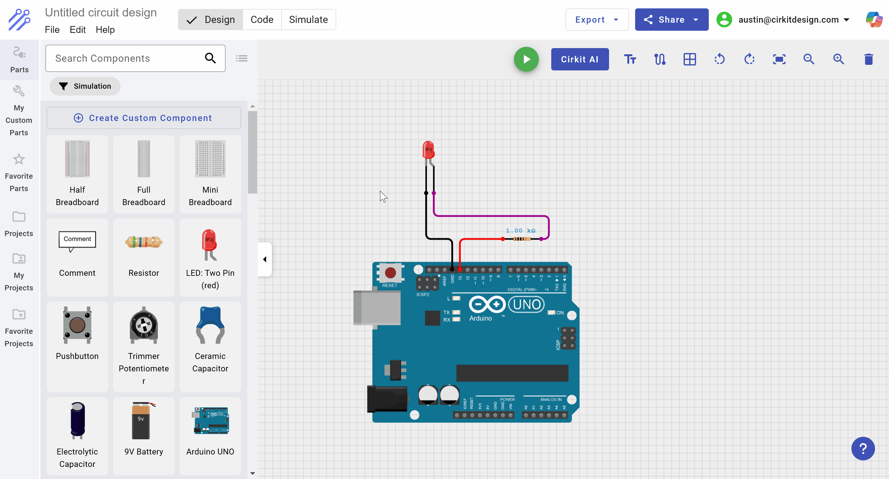
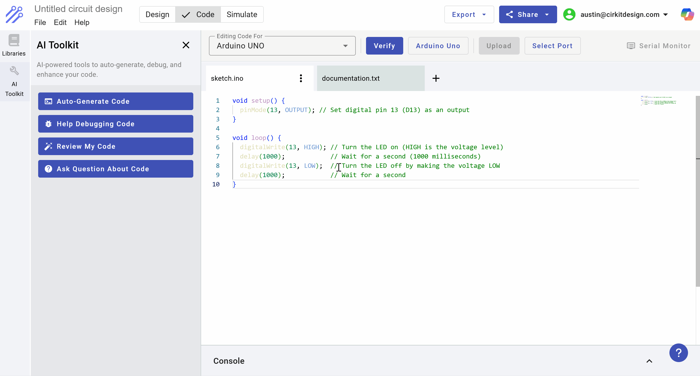
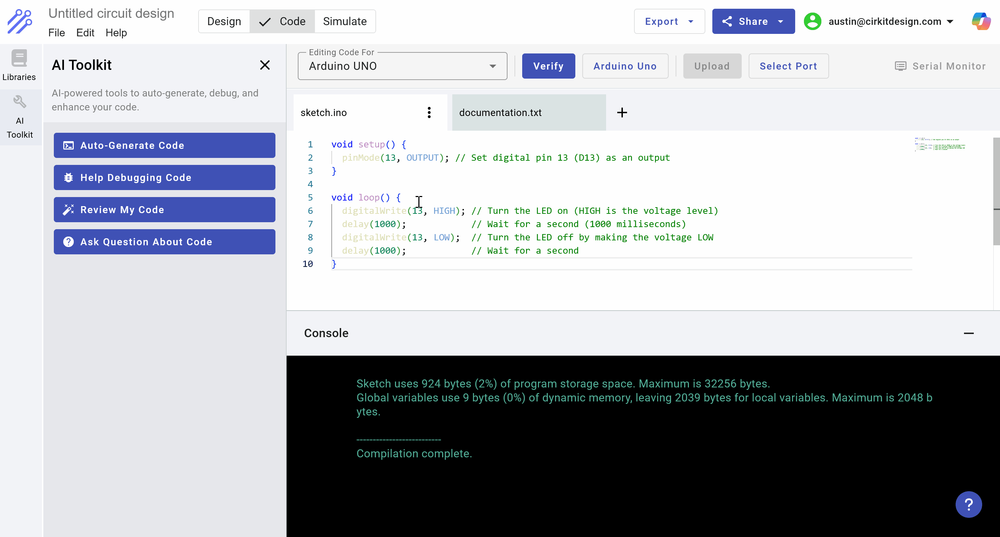
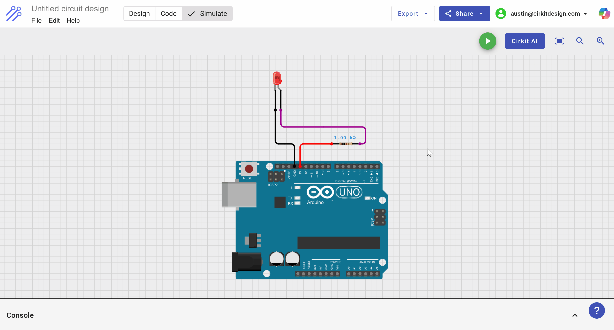

# Simulating Your Circuit With Cirkit Designer

## Introduction

In this tutorial, you’ll learn how to simulate a simple LED blinking circuit in **Cirkit Designer**. We’ll walk through selecting components, wiring them, adding Arduino code, and finally running the simulator. By the end, you’ll have a blinking LED in your virtual circuit!

---

## Brief Overview of the Cirkit Designer Interface

When you open Cirkit Designer, you’ll typically see:
- **Components Panel**: A list of parts you can drag onto your workspace.
- **Circuit Workspace**: The main area where you place and wire up components.
- **Code Editor**: Where you’ll write and edit Arduino code.
- **Simulator**: Tools for running and viewing the simulation of your circuit.

By default, the **Components Panel** and **Circuit Workspace** are visible right when you open the software. A top navigation lets you open the **Code Editor** and **Simulator** whenever you’re ready to write code or run a simulation. Having a basic understanding of these panels will help you follow the rest of this tutorial.



---

## Step 1: Selecting Components

### Finding Simulation-Compatible Parts
Not all components in the Cirkit Designer library are supported by the simulator. To find ones that are compatible:

1. Go to the **Components Panel**.  
2. Click the **Simulation Filter** button so only supported components are displayed.  


 
### Adding electronic components

For this example, we’re going to create an LED blinker circuit using:
- **Arduino UNO**
- **Red LED**
- **Resistor** (1k Ω)

We'll proceed to add these parts to our circuit. After adding these parts, your circuit should look like this:



### Wiring the components

To make the LED blink, we'll use digital pin 13 on the Arduino to control the on/off state of the LED. To do so, we will place the following wires:

- D13 on the Arduino \<-\> Pin 1 on the resistor
- Pin 2 on the resistor \<-\> Anode of the LED
- Cathod of the LED \<-\> GND (ground) on the Arduino

After placing these wires, your wiring should look like this:



---

## Step 2: Writing code to blink the LED

To control the LED, we’ll write a simple Arduino sketch that toggles pin 13 on and off:

1. Open the **Code Editor** in Cirkit Designer.  
2. Paste the following code snippet:

```ino
void setup() {
  pinMode(13, OUTPUT); // Set digital pin 13 (D13) as an output
}

void loop() {
  digitalWrite(13, HIGH); // Turn the LED on (HIGH is the voltage level)
  delay(1000);            // Wait for a second (1000 milliseconds)
  digitalWrite(13, LOW);  // Turn the LED off by making the voltage LOW
  delay(1000);            // Wait for a second
}
```



### Verifying code

Click the Verify button to check for compilation errors. If you see “Compilation complete” in the console (in green), you’re ready to simulate!



---

## Step 3: Running the simulation

To run the simulation, we'll first open the Simulator:



And then click the **Play** button to start the simulation.

If everything is wired and coded correctly, you should see the LED blink on and off with a one-second delay.



---

## Conclusion

You’ve now seen the full process of creating a circuit, adding code, and running a simulation in Cirkit Designer. With this foundational knowledge, you’re ready to experiment with more advanced projects—have fun, and happy simulating!